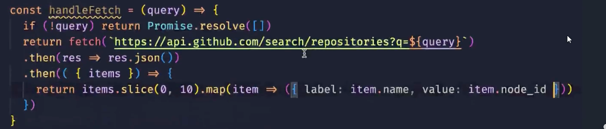

# 颜色配置
基础调色板应用：主题色：主要包含primary success danger info等 中性色：黑白灰 渐变色：过渡色 主要包text background border fill。主要是border、font、disabled等 对颜色进行事先定义 要使用的时候直接覆盖
___
# Eslint配置：代码检查工具
 pnpm create eslint-config
 ___
# postcss-comment:
更方便的css预处理器，支持each $val in array以及&：hover以及&+&
以及 [class*=xy-icon] + span等语法 指的是带有xy-icon的元素如果后跟一个元素
___

# button组件心得
按钮的<b>text font border hover active outline轮廓</b> 主要是<b>样式问题</b>
___

# collapse

## 怎么实现collapse的item开关效果？：
用一个activename数组来记录打开和关闭的item；
## 手风琴模式：
只能打开一个
```code：
 if (props.accordion)
    {
        //如果当前点击的和已经打开的不一样 则关闭已经打开的
        if (activeNames.value[0] === item)
        {
            activeNames.value = []
        } else {
            activeNames.value = [item]
        }
    } else {
        const index = activeNames.value.indexOf(item)
        if (index !== -1)
        {
            //已经打开 则关闭从数组中删除
            activeNames.value.splice(index,1)
        } else {
            activeNames.value.push(item)
        }   
    }
```
## 插槽的用法 
## provide和inject的使用
通过symbol()给provide生成唯一的标识
InjectionKey 实际上是一个泛型接口，它继承自 Symbol，能够为 provide 和 inject 提供类型信息，让 TypeScript 能够对注入和提供的数据类型进行更精准的检查。
```
provide<CollapseContext>(collpaseContextKey, {
    activeNames,handleItemClick
})
//provide的类型定义
export interface CollapseContext{
    activeNames: Ref<NameType[]>
    handleItemClick:(item:NameType)=>void
}
export const collpaseContextKey:InjectionKey<CollapseContext> =Symbol('collpaseContextKey')
//注入
const collapseContext = inject(collpaseContextKey)
```

## 有关ref和reactive的衍生
什么情况会丢失响应性？
1. 当你直接对 ref 对象进行解构时，得到的是其内部的值，而非响应式引用，这会致使响应性丢失。
   ```
   const countRef = ref(0);
   const { value: count } = countRef; 
   ```
___
使用 toRefs 来解构 ref 对象，从而保持响应性
```
    const countRef = ref(0);
    const { value: count } = toRefs({ value: countRef }); 
```
2. 要是把 ref 赋值给一个普通变量，同样会丢失响应性
` const num = numRef.value; `
3. 直接对 reactive 对象进行解构，会得到普通的非响应式属性，导致响应性丢
 ```
    const person = reactive({
    name: 'John',
    age: 30
    });

    // 使用 toRefs 解构，保持响应性
    const { name } = toRefs(person); 
 ```
 4. 如果直接用一个新对象替换整个 reactive 对象，会丢失原有的响应性
    要依次替换 不能直接一整个对象进行赋值

## watch的注意事项
由于props.modelvalue是一个ref响应式对象 如果直接用modelvalue这个值会丢失到响应性，用一个函数去获取这个值不会丢失响应性
```
watch(
  () => props.modelValue,
  () => {
    activeNames.value = props.modelValue
  }
)
```

___
## Record的用法

`Record<string, (el: HTMLElement) => void>` 是 TypeScript 中的一种类型定义，下面为你详细解释它的含义、使用场景以及示例代码。

### 含义分析

#### 1. `Record` 类型
`Record` 是 TypeScript 内置的一个工具类型，用于创建一个对象类型。它接受两个泛型参数：
 - 第一个参数指定对象的键（key）的类型。
 - 第二个参数指定对象的值（value）的类型。

#### 2. `Record<string, (el: HTMLElement) => void>` 的具体含义
 - `string` 表示对象的键的类型为字符串。这意味着该对象的所有键都必须是字符串类型。
 - `(el: HTMLElement) => void` 表示对象的值的类型为一个函数。这个函数接受一个参数 `el`，其类型为 `HTMLElement`（即 HTML 元素），并且函数没有返回值（返回类型为 `void`）。

综合起来，`Record<string, (el: HTMLElement) => void>` 定义了一个对象类型，该对象的键是字符串，值是一个接受 `HTMLElement` 类型参数且无返回值的函数。

### 使用场景
这种类型定义常用于需要将一些操作（以函数形式表示）与特定的字符串键关联起来的场景，例如事件处理程序映射、命令模式等。以下是一些具体的使用场景示例：

#### 1. 事件处理程序映射
假设你有一个组件，需要根据不同的事件名称执行不同的处理逻辑，你可以使用这种类型来定义一个事件处理程序映射对象。

#### 2. 命令模式
在命令模式中，你可以将不同的命令名称与对应的执行函数关联起来，方便根据命令名称执行相应的操作。

### 示例代码

```typescript
// 定义一个符合 Record<string, (el: HTMLElement) => void> 类型的对象
const eventHandlers: Record<string, (el: HTMLElement) => void> = {
  // 定义一个名为 'click' 的事件处理函数
  click: (el: HTMLElement) => {
    console.log(`Clicked on element: ${el.tagName}`);
  },
  // 定义一个名为 'hover' 的事件处理函数
  hover: (el: HTMLElement) => {
    console.log(`Hovered over element: ${el.tagName}`);
  }
};

// 获取一个 HTML 元素
const element = document.createElement('div');
element.textContent = 'Example Element';
document.body.appendChild(element);

// 根据事件名称调用相应的处理函数
const eventName = 'click';
if (eventHandlers[eventName]) {
  eventHandlers[eventName](element);
}
```

在上述代码中，我们定义了一个 `eventHandlers` 对象，
它的键是事件名称字符串类型，值是接受 `HTMLElement` 类型参数且无返回值的函数。然后，我们创建了一个 HTML 元素，并根据事件名称调用了相应的处理函数。通过这种方式，我们可以方便地管理和调用不同的事件处理逻辑。

## tooltip文字提示框
### 思路：用popperjs插件 动态的控制文字框的显示与隐藏 createpopper和popperinstance
触发层和展示层
基本格式：
```
<tooltip>
    <div >trigger me</div>
    <template #content>
        <h1>hellooo</h1>
    </template>
</tooltip>
```
最基本的实现
#### 需求分析 开发知识点
支持click/hover两种触发方式 v-on支持传入对象 通过不同的操作执行不同的函数
支持clickoutside的时候隐藏 利用html自带的contain函数来判断是否点击在元素外面
支持手动触发 通过manual属性实现
支持popper参数 通过popper的自带的 popperoption   Partial《Options>” 
动画 tansition
延迟显示 opendelay closedelay
样式：箭头 是一个正方形 旋转45度 然后根据样式进行选择
` &[data-popper-placement^='top'] > #arrow`


### watch的选项配置：
在 Vue 3 中，`watch` 函数提供了多个选项配置，用于更灵活地控制监听行为。以下是对这些选项配置的详细介绍：

### 1. `immediate`
- **作用**：设置为 `true` 时，`watch` 的回调函数会在创建时立即执行一次，而不是等到监听的值发生变化才执行。
- **示例**：
```vue
<template>
  <div>
    <p>{{ count }}</p>
    <button @click="count++">Increment</button>
  </div>
</template>

<script setup>
import { ref, watch } from 'vue';

const count = ref(0);

watch(count, (newVal, oldVal) => {
  console.log(`New value: ${newVal}, Old value: ${oldVal}`);
}, { immediate: true });
</script>
```
在上述代码中，由于 `immediate: true`，回调函数会在组件创建时立即执行一次，输出初始的 `newVal` 和 `oldVal`。

### 2. `deep`
- **作用**：当监听的值是对象或数组时，默认情况下 `watch` 只会监听对象或数组的引用变化，而不会监听其内部属性的变化。将 `deep` 设置为 `true` 可以让 `watch` 深度监听对象或数组内部属性的变化。
- **示例**：
```vue
<template>
  <div>
    <button @click="obj.name = 'New Name'">Change Name</button>
  </div>
</template>

<script setup>
import { ref, watch } from 'vue';

const obj = ref({ name: 'Original Name' });

watch(obj, (newVal, oldVal) => {
  console.log('Object has changed:', newVal);
}, { deep: true });
</script>
```
在这个例子中，当 `obj.name` 发生变化时，由于 `deep: true`，回调函数会被触发。

### 3. `flush`
- **作用**：控制回调函数的执行时机，有三个可选值：`'pre'`、`'post'` 和 `'sync'`。
  - **`'pre'`**：默认值，回调函数会在组件更新之前执行。
  - **`'post'`**：回调函数会在组件更新之后执行，确保在 DOM 更新完成后再执行回调。
  - **`'sync'`**：回调函数会在监听的值发生变化后立即同步执行。
- **示例**：
```vue
<template>
  <div>
    <p>{{ count }}</p>
    <button @click="count++">Increment</button>
  </div>
</template>

<script setup>
import { ref, watch } from 'vue';

const count = ref(0);

watch(count, (newVal) => {
  console.log('Count has changed:', newVal);
}, { flush: 'post' });
</script>
```
这里 `flush: 'post'` 表示回调函数会在组件更新后执行。

### 4. `onTrack` 和 `onTrigger`
- **`onTrack`**：当响应式依赖被追踪时触发，主要用于调试目的，可以观察哪些依赖被追踪。
- **`onTrigger`**：当监听的响应式数据发生变化并触发回调时执行，同样用于调试。
- **示例**：
```vue
<template>
  <div>
    <p>{{ count }}</p>
    <button @click="count++">Increment</button>
  </div>
</template>

<script setup>
import { ref, watch } from 'vue';

const count = ref(0);

watch(count, (newVal) => {
  console.log('Count has changed:', newVal);
}, {
  onTrack(e) {
    console.log('Tracked:', e);
  },
  onTrigger(e) {
    console.log('Triggered:', e);
  }
});
</script>
```
在上述代码中，当 `count` 被追踪或发生变化时，`onTrack` 和 `onTrigger` 会分别输出相应的调试信息。

### 5. `flushSync`
- **作用**：如果使用了 `flush: 'sync'`，可以使用 `flushSync` 函数来强制同步刷新所有的 `watch` 回调，确保所有的变化都被立即处理。
- **示例**：
```vue
<template>
  <div>
    <p>{{ count }}</p>
    <button @click="increment">Increment</button>
  </div>
</template>

<script setup>
import { ref, watch, flushSync } from 'vue';

const count = ref(0);

watch(count, (newVal) => {
  console.log('Count has changed:', newVal);
}, { flush: 'sync' });

const increment = () => {
  flushSync(() => {
    count.value++;
  });
};
</script>
```
在这个例子中，`flushSync` 确保 `count` 的变化会立即触发 `watch` 回调。

### 6. `source` 相关选项（Vue 3.2+）
- 可以使用 `source` 选项来指定监听的数据源，支持多个数据源。
- **示例**：
```vue
<template>
  <div>
    <p>{{ count1 }}</p>
    <p>{{ count2 }}</p>
    <button @click="count1++">Increment Count 1</button>
    <button @click="count2++">Increment Count 2</button>
  </div>
</template>

<script setup>
import { ref, watch } from 'vue';

const count1 = ref(0);
const count2 = ref(0);

watch([count1, count2], ([newCount1, newCount2], [oldCount1, oldCount2]) => {
  console.log(`Count 1: ${newCount1}, Count 2: ${newCount2}`);
});
</script>
```
这里通过数组的形式同时监听 `count1` 和 `count2` 的变化。

这些选项配置可以让你根据具体的需求灵活控制 `watch` 的行为，提高代码的可维护性和性能。 


### Partial《Options>” 
通常在编程语言中出现，比如在 TypeScript 中。“Partial” 表示将一个类型的所有属性变为可选的。

## dropdown组件的思路
主要是用tooltip完成
学习点：虚拟vnode的生成
setup 函数返回渲染函数：setup 函数返回了一个箭头函数，这个箭头函数就是渲染函数。渲染函数的作用是返回一个虚拟节点，Vue 会根据这个返回的虚拟节点来生成真实的 DOM 节点。在这个例子中，渲染函数直接返回了 props.vNode，也就是传入的虚拟节点。
直接渲染成节点的原理
当父组件将一个有效的虚拟节点作为 item.label 传递给 RenderVnode 组件时： RenderVnode 组件接收到这个虚拟节点作为 props.vNode。
setup 函数返回的渲染函数将 props.vNode 返回给 Vue 的渲染机制。
Vue 的渲染机制接收到这个虚拟节点后，会根据虚拟节点的描述信息（如标签名、属性、子节点等）来创建对应的真实 DOM 节点。 -->
```
import { defineComponent } from "vue";
const RenderVnode = defineComponent({
    props: {
        vNode: {
            type: [String, Object],
            required: true
        }
    },
    setup(props) {
        return () => props.vNode
    }
})
export default RenderVnode;
```

## Message组件
需求分析：
1、在点击或者其他特定行为的时候弹出一个提示框
2、在一定时间后消失 持续时间duration
3、支持手动关闭 showclose
4、可以弹出多个提示 怎么动态调整组件的属性？ 获取每个组件的offset以及height进行计算
5、多种类型 primary、danger等 css处理

#### 难点？？：不是一个组件 是一个反馈式的 所以应该写成一个函数形式：
props传入的时候会由组件库自动的添加id和vm：vnode.component等参数 因为些参数是用户用不到 但是组件库要用到 用于计算高度以及销毁组件的
导出一个createmessage函数 并利用render函数进行渲染
```const instance：MessageContext= { id, vnode,vm,props: newProps }
import MessageConstructor from './Message.vue'
 const newProps = {
        ...props,
        id,
        onDestory: destory,
    }
 const container = document.createElement('div')
const vnode = h(MessageConstructor, newProps)
//创建实例
render(vnode, container)
//销毁实例
render(null, container)

```
组件的动态构造并传入属性：
```
 const newProps = {
        ...props,
        id,
        zIndex: nextZIndex(),
        onDestory: destory,
    }
    const vnode = h(MessageConstructor, newProps)
```
怎么计算组件高度？
组件高度
`height.value = messageRef.value!.getBoundingClientRect().height`
```
const height = ref(0)
// 上一个实例的最下面的坐标数字，第一个是0
const lastOffset = computed(() => getLastBottomOffset(props.id))
// 这个元素应该使用的top
const topOffset = computed(() => props.offset + lastOffset.value)
// 这个元素为下一个元素预留的offset，也就是它最低端bottom的值会暴露出去
const bottomOffset = computed(() => height.value + topOffset.value)

```

//“getCurrentInstance” 可以获取当前组件的实例。
// const instance = getCurrentInstance()
ComponentInternalInstance
getCurrentInstance 返回的是组件的内部实例 ComponentInternalInstance，这是 Vue 的内部 API。


## h 函数
h 函数是 Vue 中用于创建虚拟节点的核心函数。在 Vue 3 里，你可以从 vue 模块中引入它，其完整名称是 createVNode，不过 h 是一个常用的别名。以下是一个简单的引入示例：
javascript
import { h } from 'vue';
h 函数通常接收三个参数：
第一个参数：可以是 HTML 标签名（如 'div'）、组件构造函数（像这里的 MessageConstructor）或者其他 Vue 组件。
第二个参数：是一个可选的对象，用于传递给组件的属性（props）、事件监听器等。
第三个参数：同样是可选的，代表子节点，可以是字符串、数组或者其他虚拟节点。

优化点：添加zindex通过hooks提取zindex的递增
#### unref
而 unref 函数的作用就是简化从 ref 对象中获取其内部值的操作。如果传入的参数是一个 ref 对象，unref 会返回该 ref 对象的 value 属性；如果传入的不是 ref 对象，unref 会直接返回传入的参数本身。

### watch的特性 为什么可以直接访问removeeventlistener的原因
 watch 回调中 value 可直接访问 removeEventListener 的原因
watch 函数在监听 ref 对象时，其回调函数接收到的新值和旧值会自动解包 ref 对象。也就是说，当你监听一个 ref 对象时，回调函数里的参数已经是 ref 对象的 value，而不再是 ref 对象本身。
 
 ```
 import { onMounted, onBeforeMount, isRef, watch, unref } from 'vue'
import type { Ref } from 'vue'
export default function useEventListener(
  target: Ref<EventTarget | null> | EventTarget,
  evnet: string,
  handler: (event: Event) => any
) {
  if (isRef(target)) {
    watch(target, (value, oldValue) => {
        oldValue?.removeEventListener(evnet, handler)
        value?.addEventListener(evnet, handler)
    })
  } else {
    onMounted(() => {
      target.addEventListener(evnet, handler)
    })
  }
  onBeforeMount(() => {
    unref(target)?.removeEventListener(evnet, handler)
  })
}

 ```

### hover上去的时候不会消失：
 创建定时器 当mouseenter的时候就清除 mouseleave的时候就重新开始计时


 # vitepress的使用方法
 具体使用方式查看[vitepress官网](https://vitepress.dev/zh/guide/what-is-vitepress)
 <br></br>
 对于静态展示页面 博客等网页十分便利
  通过preview插件来实现组件和代码展示

# input组件
1.  需求分析：
   *支持input/textarea
   *支持不同大小
   *支持一键清空
   *支持切换是否密码显示
   *支持自定义前缀或者后缀（icon）
## input组件定义需要哪些type？
根据组件的需求初步确定属性 事件等  slots expose
组件的静态版本 支持前缀和后缀 那就使用icon或者slot来插入到input组件中 将change clear focus 等事件暴露出去给用户使用
```
    type?: string
    modelValue: string
    size?: 'large' | 'small'
    clearable?: boolean
    showPassword?: boolean
    disabled?: boolean
    placeholder?: string
    readonly?: boolean
    autocomplete?: string
    autofocus?: boolean
    form?: string
```
# emit在vue3中的使用
在 Vue 中，`emit` 是一个非常重要的概念，主要用于在子组件向父组件传递数据或触发父组件的方法，通常和自定义事件结合使用。下面将从基本用法、参数传递、事件命名规范、在不同 Vue 版本中的使用方式等方面详细介绍 `emit` 的用法。

### 1. Vue 3 中 `<script setup>` 语法下的基本用法
在 Vue 3 的 `<script setup>` 语法中，使用 `defineEmits` 来定义子组件可以触发的事件，然后通过 `emit` 触发这些事件。

#### 子组件示例
```vue
<template>
  <button @click="handleClick">点击触发父组件方法</button>
</template>

<script setup>
import { defineEmits } from 'vue';

// 定义可以触发的事件
const emit = defineEmits(['parentMethod']);

const handleClick = () => {
  // 触发父组件的 parentMethod 方法
  emit('parentMethod');
};
</script>
```

#### 父组件示例
```vue
<template>
  <ChildComponent @parentMethod="parentMethodHandler" />
</template>

<script setup>
import ChildComponent from './ChildComponent.vue';

const parentMethodHandler = () => {
  console.log('父组件方法被触发');
};
</script>
```
在上述代码中，子组件通过 `defineEmits` 定义了一个名为 `parentMethod` 的自定义事件，当按钮被点击时，调用 `emit('parentMethod')` 触发该事件。父组件通过 `@parentMethod` 监听这个事件，并绑定了 `parentMethodHandler` 方法，当事件触发时，父组件的 `parentMethodHandler` 方法会被调用。

### 2. 传递参数
`emit` 方法还可以传递参数给父组件，在子组件触发事件时，将参数作为 `emit` 方法的后续参数传入。

#### 子组件示例
```vue
<template>
  <button @click="handleClick">传递参数给父组件</button>
</template>

<script setup>
import { defineEmits } from 'vue';

const emit = defineEmits(['sendData']);

const handleClick = () => {
  const data = '这是子组件传递的数据';
  // 触发事件并传递参数
  emit('sendData', data);
};
</script>
```

#### 父组件示例
```vue
<template>
  <ChildComponent @sendData="receiveData" />
</template>

<script setup>
import ChildComponent from './ChildComponent.vue';

const receiveData = (data) => {
  console.log('接收到子组件传递的数据：', data);
};
</script>
```
在这个例子中，子组件触发 `sendData` 事件时，传递了一个字符串参数 `data`，父组件的 `receiveData` 方法接收到这个参数并进行处理。

### 3. 事件命名规范
Vue 建议使用 kebab-case（短横线分隔命名）来命名自定义事件，这样可以避免大小写敏感问题，并且与 HTML 标签属性的命名风格保持一致。例如：
```vue
<template>
  <button @click="handleClick">触发自定义事件</button>
</template>

<script setup>
import { defineEmits } from 'vue';

const emit = defineEmits(['custom-event']);

const handleClick = () => {
  emit('custom-event');
};
</script>
```

### 4. 在普通 Vue 3 组件中的使用
如果不使用 `<script setup>` 语法，在普通的 Vue 3 组件中使用 `emit` 略有不同。

#### 子组件示例
```vue
<template>
  <button @click="handleClick">触发父组件方法</button>
</template>

<script>
export default {
  emits: ['parentMethod'],
  methods: {
    handleClick() {
      this.$emit('parentMethod');
    }
  }
};
</script>
```

#### 父组件示例
```vue
<template>
  <ChildComponent @parentMethod="parentMethodHandler" />
</template>

<script>
import ChildComponent from './ChildComponent.vue';

export default {
  components: {
    ChildComponent
  },
  methods: {
    parentMethodHandler() {
      console.log('父组件方法被触发');
    }
  }
};
</script>
```
在普通组件中，通过 `emits` 选项定义可以触发的事件，然后使用 `this.$emit` 方法触发事件。

### 5. Vue 2 中的使用
在 Vue 2 中，没有 `defineEmits` 方法，直接使用 `this.$emit` 来触发自定义事件。

#### 子组件示例
```vue
<template>
  <button @click="handleClick">触发父组件方法</button>
</template>

<script>
export default {
  methods: {
    handleClick() {
      this.$emit('parentMethod');
    }
  }
};
</script>
```

#### 父组件示例
```vue
<template>
  <ChildComponent @parentMethod="parentMethodHandler" />
</template>

<script>
import ChildComponent from './ChildComponent.vue';

export default {
  components: {
    ChildComponent
  },
  methods: {
    parentMethodHandler() {
      console.log('父组件方法被触发');
    }
  }
};
</script>
```

综上所述，`emit` 是 Vue 中实现子组件向父组件通信的重要手段，通过定义和触发自定义事件，可以方便地在组件之间传递数据和触发方法。不同的 Vue 版本在使用方式上略有差异，但核心原理是一致的。 

# slot
访问插槽内容：$slot 允许组件在其内部访问通过插槽传递进来的内容


# select组件 ---有难度 本质是input和tooltip的组合
```
<select 
placeholder="select"
:option="options"
v-model="selectValue">

</select>
```
## 需求分析：
1. 点击展开下拉选项菜单
2. 点击菜单的某一项，下拉菜单关闭
3. 获取选中的状态 并填充对应的选项
## 高级的功能
1. 可清空选项 当hover上去的时候 在组件右侧显示一个可清空的按钮
2. 自定义模版：自定义下拉菜单的选项格式
3. 可筛选：允许输入 输入后根据字符自动过滤菜单选项
4. 支持远程搜索 类似于自动联想 根据输入的字符发送请求 渲染返回的内容作为选项列表
5. 扩展支持？ 键盘移动
6. 可支持多选？

# fetch
# promise


Promise 并不必须与网络请求一起使用，它是 JavaScript 中处理异步操作的通用解决方案。以下是 Promise 的独立意义和常见应用场景：

---

### **1. 异步操作的通用封装**
Promise 的核心价值在于将异步操作封装为一个可管理的对象，无论具体场景是：
- **网络请求**（如 `fetch`）
- **定时器**（如 `setTimeout`）
- **文件操作**（Node.js 中）
- **数据库查询**（如 SQL 操作）

**示例：用 Promise 封装定时器**
```javascript
const delay = (ms) => new Promise(resolve => {
  setTimeout(() => resolve(`延迟 ${ms}ms`), ms);
});

// 使用
delay(1000)
  .then(result => console.log(result)) // 1秒后输出 "延迟 1000ms"
  .catch(error => console.error(error));
```

---

### **2. 同步代码的延迟执行**
即使没有实际的异步操作（如立即执行的任务），Promise 也可以用于：
- **将任务推迟到微任务队列**（避免阻塞主线程）
- **统一处理异步/同步逻辑**

**示例：立即执行的 Promise**
```javascript
const syncPromise = Promise.resolve("同步结果");
syncPromise.then(console.log); // 输出 "同步结果"
```

---

### **3. 错误处理的统一入口**
Promise 通过 `.catch()` 提供集中的错误处理机制，无论异步操作是否成功，都可以统一捕获异常。

**示例：混合同步和异步错误**
```javascript
const riskyPromise = Promise.reject(new Error("模拟错误"));
riskyPromise
  .then(result => console.log(result))
  .catch(error => console.error("错误：", error.message)); // 输出 "错误：模拟错误"
```

---

### **4. 并行或顺序执行多个任务**
Promise 提供了 `Promise.all()`、`Promise.race()` 等方法，可轻松管理多个异步操作的执行顺序。

**示例：并行执行多个定时器**
```javascript
const promises = [
  delay(1000),
  delay(2000),
  delay(3000)
];

Promise.all(promises)
  .then(results => console.log(results)) // 3秒后输出所有结果
  .catch(error => console.error(error));
```

---

### **5. 测试与模拟**
在单元测试中，Promise 可以模拟异步行为，无需真实发起请求或操作。

**示例：测试异步函数**
```javascript
// 模拟 API 调用
const mockApi = () => Promise.resolve({ data: "测试数据" });

// 测试逻辑
mockApi()
  .then(data => expect(data).toEqual({ data: "测试数据" }));
```

---

### **总结**
Promise 的核心意义在于：
- **统一异步编程模型**：替代回调地狱，使代码更易读。
- **增强错误处理**：通过 `.catch()` 集中捕获异常。
- **灵活控制流程**：支持串行、并行、竞争等多种执行模式。

**即使没有网络请求**，只要存在异步操作（如定时器、文件读写等），Promise 就有其独立价值。它是 JavaScript 异步编程的基石，而网络请求只是其常见应用场景之一。


`Promise` 和 `async/await` 是 JavaScript 中处理异步操作的两种核心方式，它们的核心机制相同（基于 Promise），但语法和使用场景有所区别。以下是它们的对比：

---

### **1. 语法风格**
- **Promise**：通过 `.then()` 和 `.catch()` 链式调用处理异步结果。
  ```javascript
  fetch('https://api.example.com/data')
    .then(response => response.json())
    .then(data => console.log(data))
    .catch(error => console.error(error));
  ```
- **async/await**：用同步代码的写法处理异步逻辑，通过 `async` 声明函数，`await` 等待 Promise 结果。
  ```javascript
  async function fetchData() {
    try {
      const response = await fetch('https://api.example.com/data');
      const data = await response.json();
      console.log(data);
    } catch (error) {
      console.error(error);
    }
  }
  fetchData();
  ```

---

### **2. 核心差异**
| **特性**          | **Promise**                          | **async/await**                    |
|-------------------|--------------------------------------|------------------------------------|
| **语法**          | 链式调用（`.then()`）                | 同步风格（`await`）               |
| **错误处理**      | `.catch()` 统一捕获                   | `try/catch` 结构化捕获            |
| **代码可读性**    | 嵌套多层时易形成“回调地狱”           | 更接近同步代码，可读性更高        |
| **返回值**        | 直接返回 Promise                     | `async` 函数返回 Promise，`await` 等待 Promise |
| **并行执行**      | 需要 `Promise.all()` 或 `Promise.race()` | 需配合 `Promise.all()` 实现并行  |

---

### **3. 适用场景**
- **优先使用 async/await**：
  - 需要顺序执行多个异步操作（如先登录再获取用户信息）。
  - 代码逻辑复杂，需要清晰的结构（避免多层 `.then()` 嵌套）。
  - 习惯同步代码写法的开发者。

- **优先使用 Promise**：
  - 简单的异步操作（如单次 `fetch` 请求）。
  - 需要并行执行多个异步操作（如 `Promise.all([fetch1, fetch2])`）。
  - 需要更细粒度的控制（如中断请求、动态添加回调）。

---

### **4. 底层关系**
- `async/await` 是 Promise 的语法糖，本质上还是基于 Promise 实现的。
- `await` 后面必须跟一个 Promise，或者会被自动转换为 Promise 的值（如 `await 1` 等价于 `await Promise.resolve(1)`）。
- `async` 函数返回的总是一个 Promise，即使没有显式返回。

---

### **5. 对比示例**
#### **Promise 实现**
```javascript
function fetchUser() {
  return fetch('https://api.example.com/user')
    .then(response => response.json())
    .then(data => {
      if (!data.isValid) throw new Error('用户无效');
      return data;
    })
    .catch(error => {
      console.error('用户请求失败:', error);
      return null;
    });
}
```

#### **async/await 实现**
```javascript
async function fetchUser() {
  try {
    const response = await fetch('https://api.example.com/user');
    const data = await response.json();
    if (!data.isValid) throw new Error('用户无效');
    return data;
  } catch (error) {
    console.error('用户请求失败:', error);
    return null;
  }
}
```

---

### **总结**
- **Promise**：是异步操作的基础，适合简单场景或需要灵活控制的场景。
- **async/await**：通过语法糖简化异步代码，使逻辑更清晰，适合复杂或顺序执行的异步操作。
- **两者相辅相成**：在实际开发中，通常会结合使用（例如用 `Promise.all()` 并行请求，再用 `await` 等待结果）。
# 防抖debounce lodash
